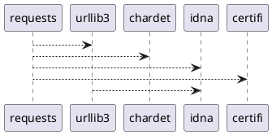

# Dependency Visualizer

Это инструмент командной строки на Python для визуализации графа зависимостей пакетов Python. Он собирает зависимости, включая транзитивные, и генерирует код в формате PlantUML, который можно использовать для создания графических диаграмм зависимостей.

## Особенности

- Сбор зависимостей пакета и его транзитивных зависимостей.
- Генерация кода PlantUML для визуализации зависимостей.
- Вывод результата в указанный файл и на экран.

## Установка

1. Убедитесь, что у вас установлен Python (версии 3.6 или выше).
2. Установите необходимые библиотеки:

   ```bash
   pip install setuptools
   ```

## Использование

1. Скачайте или клонируйте репозиторий:

   ```bash
   git clone https://github.com/ваш_логин/ваш_репозиторий.git
   cd ваш_репозиторий
   ```

2. Создайте файл `dependency_visualizer.py` и вставьте в него код из примера.

3. Убедитесь, что у вас установлен пакет, который вы хотите проанализировать. Например, для пакета `requests` выполните:

   ```bash
   pip install requests
   ```

4. Запустите скрипт с необходимыми аргументами:

   ```bash
   python dependency_visualizer.py /path/to/plantuml requests output.puml http://github.com/psf/requests
   ```

   - `/path/to/plantuml` — путь к исполняемому файлу PlantUML (если требуется).
   - `requests` — имя анализируемого пакета.
   - `output.puml` — путь к файлу, в который будет записан код PlantUML.
   - `http://github.com/psf/requests` — URL-адрес репозитория пакета.

## Пример вывода

После выполнения команды будет создан файл `output.puml` с содержимым, подобным следующему:



## Визуализация

Для визуализации графа зависимостей с помощью PlantUML выполните следующую команду:

```bash
java -jar plantuml.jar output.puml
```

Это создаст изображение, представляющее зависимости пакета.
